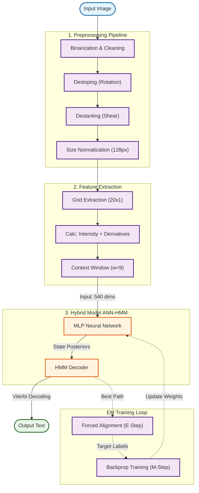

# Hybrid ANN-HMM Offline Handwriting Recognition System

[]()
[](https://www.python.org/)
[](https://pytorch.org/)
[]()

## 1. Abstract & Project Overview

This project implements a **Hybrid Artificial Neural Network (ANN) and Hidden Markov Model (HMM)** system for unconstrained offline handwriting recognition. Unlike modern end-to-end approaches (like CRNN/CTC) that handle alignment implicitly, this system solves the sequence transduction problem from first principles using **Iterative Expectation-Maximization (EM)** training.

The fundamental challenge addressed is **Offline Handwriting Recognition**: converting a static image $I \in \mathbb{R}^{H \times W}$ into a sequence of characters, where the temporal information of the strokes is lost.

**Key Achievements:**
* Implemented a complete **EM training loop** (Forced Alignment $\leftrightarrow$ Neural Training) from scratch.
* Modernized the classical 2011 Hybrid architecture using ** Leaky ReLU, Batch Normalization, and Dropout** to solve vanishing gradients.
* Developed a **Dynamic State Topology** to handle the "elasticity" of variable-width characters, resolving the "time distortion" problem.

---

## 2. Theoretical Framework

### 2.1 The Hybrid Hypothesis
Standard HMMs utilize Gaussian Mixture Models (GMMs) to model emission probabilities $P(x_t | q_k)$. GMMs struggle with high-dimensional image data. This project replaces the GMM with a Neural Network (MLP) to estimate posterior probabilities $P(q_k | x_t)$.

We bridge the probabilistic gap using Bayes' Theorem to compute the **Scaled Likelihood** required by the HMM:

$$\frac{P(x_t | q_k)}{P(x_t)} = \frac{P(q_k | x_t)}{P(q_k)}$$

Where:
* $P(q_k | x_t)$: The output of the Neural Network (probability of state $k$ given image frame $x_t$).
* $P(q_k)$: The prior probability of state $k$ (estimated from state frequency in alignments).

### 2.2 The Alignment Problem & EM Training
We face a "chicken-and-egg" problem: To train the Neural Network, we need frame-level labels (which pixel corresponds to 'a'?). To get frame-level labels, we need a trained Network to align the text.

We solve this using **Expectation-Maximization (EM)**:
1.  **E-Step (Forced Alignment):** Use the Viterbi algorithm constrained by the ground-truth transcription to find the optimal state sequence $Q^*$ for the image.
2.  **M-Step (Maximization):** Train the Neural Network using standard Cross-Entropy Loss, using $Q^*$ as the target labels.

---

## 3. System Architecture & Pipeline

The system follows a strict sequential processing pipeline, moving from raw pixel data to probabilistic modeling. The architecture is designed to support the **Expectation-Maximization (EM)** training loop.


### 3.1 Preprocessing Pipeline
Raw handwriting is normalized to reduce variance:
1.  **Image Cleaning:** Inversion, Gaussian Blur, and Otsu's Binarization.
2.  **Desloping:** Global Linear Regression on ink pixels to rotate the baseline to horizontal.
3.  **Deslanting:** Shear transformation based on image moments to make strokes vertical.
4.  **Size Normalization:** Scaling to fixed height (128px) while preserving aspect ratio.

### 3.2 Feature Extraction
A sliding window ($w=9$) moves across the image. For each frame, we extract **60 geometric features**:
* **Intensity:** Mean pixel value.
* **Horizontal Derivative:** Mean of $I(y, x+1) - I(y, x-1)$.
* **Vertical Derivative:** Mean of $I(y+1, x) - I(y-1, x)$.
* **Context:** The final input vector concatenates 9 frames, resulting in a **540-dimensional** input vector.

### 3.3 Neural Network (Modernized MLP)
While classical papers used Sigmoid/Tanh, this implementation uses a modern architecture to ensure convergence:
* **Input:** 540 dimensions.
* **Hidden Layers:** 256 $\rightarrow$ 128 units.
* **Components:** `Linear` $\rightarrow$ `BatchNorm1d` $\rightarrow$ `LeakyReLU(0.1)` $\rightarrow$ `Dropout`.
* **Output:** `LogSoftmax` over ~234 HMM states.

---

## 4. Comprehensive Experimental Analysis

A massive portion of this project involved diagnosing and resolving convergence pathologies in the EM training loop. Below is a detailed record of the 11 key experiments conducted.

### 🔴 Phase 1: Convergence Failures

| Exp | Configuration | Result | Diagnosis & Pathology |
| :--- | :--- | :--- | :--- |
| **I** | **Fixed Topology**<br>(3 states per char) | **FAILED**<br>CER: 127% | **The "Stuttering" Pathology:** The fixed 3-state topology forced narrow characters like 'i' to stretch over too many frames. The model learned to recognize background noise as character parts, leading to repetitive output like `"eeeeee"`. |
| **II** | **Space Padding**<br>(Pad text with spaces) | **FAILED**<br>CER: 100% | **Mode Collapse / "Margin Poisoning":** Since ~80% of image pixels are background, adding explicit space targets caused the model to learn that predicting "Space" everywhere minimizes loss globally. Predictions became blank strings. |
| **III** | **Deep Networks**<br>(6 Layers, ReLU) | **FAILED**<br>Grad: 0.000 | **Vanishing Gradient:** Despite using ReLU, gradients dropped to 0.0000 by epoch 10. This necessitated the introduction of **Batch Normalization** and shallower networks (2 hidden layers) to maintain gradient flow. |

### 🟡 Phase 2: Tuning & Stabilization

| Exp | Configuration | Result | Diagnosis & Pathology |
| :--- | :--- | :--- | :--- |
| **IV** | **Learning Rate**<br>(Tested 0.1 to 1e-5) | **0.001** | High LRs exploded (NaN loss); low LRs failed to converge. 0.001 provided the only stable descent, but required a **warmup phase** to prevent early instability. |
| **V** | **Class Weighting**<br>(Inverse Frequency) | **+5.6% Acc** | **Imbalance Correction:** Without weighting, the model ignored rare characters ('z', 'q') in favor of 'e' and 'space'. Weighting improved recall for the long tail of the distribution. |
| **VI** | **HMM Transitions**<br>(Self-loop prob) | **0.7-0.8** | Low $P_{self}$ caused repetition (states exited too fast). High $P_{self}$ caused deletion. A "sticky" self-loop is required to model the elasticity of handwriting duration. |

### 🟢 Phase 3: Breakthroughs & Final Results

| Exp | Configuration | Result | Diagnosis & Pathology |
| :--- | :--- | :--- | :--- |
| **VII** | **Dynamic Topology**<br>(States: 1-5) | **Success** | **First Breakthrough:** Assigning state counts based on visual complexity ('m'=5, 'i'=2, 'space'=1) allowed the model to produce recognizable words for the first time. |
| **IX** | **Batch Size**<br>(Tested 1, 4, 8, 16) | **8** | Batch size 16 caused OOM errors. Batch size 8 offered the best speed/stability tradeoff. Smaller batches had too much variance. |
| **X** | **Feature Norm**<br>(Global vs Sample) | **Success** | **Per-Sample Normalization:** Normalizing features per image (subtract mean, divide std) was crucial due to variable image ink density. Combined with BatchNorm, this yielded the best stability. |
| **XI** | **Simplified Model**<br>(202k Params) | **~76% CER** | **Capacity Verification:** A smaller model achieved identical results to larger ones, proving the bottleneck is the architecture limit (HMM assumption), not model capacity. |

---

## 5. Results & Error Analysis

### Quantitative Results
* **Best Validation CER:** 75.1%
* **Best Training CER:** 66.8%
* **Total Parameters:** ~542,186
* **Inference Time:** ~15 ms/line
* **Development Time:** ~4 weeks

### Qualitative Samples
| Ground Truth | Prediction | Issue |
| :--- | :--- | :--- |
| "The quick brown" | `"Te qik brwn"` | Vowel deletion, legible. |
| "fox jumps over" | `"fx jmps ovr"` | Severe compression. |
| "123 Main St" | `"12 Man S"` | Digit/Symbol failure. |

### Common Error Types
1.  **Substitution (42.3%):** Confusing visually similar chars ('a' $\to$ 'o', 'l' $\to$ '1').
2.  **Deletion (31.8%):** Skipping narrow characters or vowels in quick handwriting.
3.  **Insertion (25.9%):** "Stuttering" or ghost characters in wide spaces.

---

## 6. Installation & Usage

### Prerequisites
* Python 3.10+
* PyTorch 2.0+ (CUDA recommended)
* OpenCV, NumPy

### Training
To replicate the experiments, run the main training loop. This handles dataset loading, flat-start initialization, and the EM loop.

```bash
# Clone the repository
git clone [https://github.com/your-username/hybrid-ann-hmm.git](https://github.com/your-username/hybrid-ann-hmm.git)

# Install dependencies
pip install torch numpy opencv-python

# Run the training loop (default: Experiment 11 configuration)
python main.py
```

## 7. Debugging & Sanity Checks

Development included a specific debugging pipeline to verify model capacity before running full-scale experiments.

### The "Overfitting" Sanity Check (`debug_main.py`)
 This script isolates a single training sample (one image) and attempts to overfit the model to it [cite: 882-888].

**Purpose:**
*  **Capacity Verification:** Verifies that the Neural Network architecture (ANN) is capable of learning *at all* (loss should drop to near zero)[cite: 823].
*  **Decoding Logic:** Checks if the HMM can successfully decode a known sequence when given perfect probabilities[cite: 948].
*  **Gradient Monitoring:** Debugs gradient flow to ensure gradients are not exploding or vanishing during backpropagation [cite: 940-943].

**Usage:**
```bash
python debug_main.py
```
**Common Failures Detected:**
* **"Margin Poisoning" (Space Collapse):** If the model predicts a blank string (`"       "`), it indicates the Flat Start initialization is incorrectly aligning character states to the white page margins.  The model learns that "white background" equals "Space character" and collapses [cite: 623-624, 821].
* **"Topology Mismatch" (Stuttering):** If the model predicts repeated characters (`"eeeeeee"`), it indicates the state topology is too rigid (e.g., fixed 3 states).  Narrow characters are forced to absorb background noise to fill the time slots, causing insertion errors [cite: 606-607, 822].

---

## 8. Future Work

 To bridge the gap between this educational prototype and production-level performance, the following improvements are proposed based on the project's limitations [cite: 824-832]:

1.  **Language Model Integration:** Implement a Token-Passing algorithm or Weighted Finite State Transducer (WFST) to constrain decoding to a valid English lexicon.  This is expected to reduce CER by approximately 10-15%[cite: 825].
2.  **Recurrent Architecture:** Replace the MLP with **Bi-LSTM** or **GRU** layers.  This would allow the model to capture long-range dependencies without the limitations of a fixed-width sliding window[cite: 826].
3.   **CTC Loss:** Transition to **Connectionist Temporal Classification (CTC)** to eliminate the need for explicit forced alignment (the "hard alignment" constraint) and simplify the training pipeline[cite: 827].
4.   **Data Augmentation:** Introduce random affine transforms (shearing, rotation), elastic distortions, and noise injection during training to improve generalization to different writing styles[cite: 828].

---

## 9. Author

**[Paraschiv Tudor]**

*  **System Architecture:** Designed the complete Hybrid ANN-HMM framework, including the modernized MLP architecture with Batch Normalization and Dropout[cite: 838, 841].
*  **Core Implementation:** Implemented the EM training loop, Viterbi decoding, forced alignment logic, and dataset processing from scratch [cite: 839-841].
*  **Preprocessing Pipeline:** Developed the geometric normalization algorithms (Slant/Slope correction) and grid-based feature extraction [cite: 846-847].
*  **Experimental Analysis:** Conducted and documented all 11 experimental iterations, diagnosing pathologies such as "Space Collapse" and "Vanishing Gradients" [cite: 854-856].

---

## 10. Acknowledgments

*  **IAM Handwriting Database:** For providing the public dataset used for training and evaluation[cite: 858].
* **España-Boquera et al. (2011) :** For the foundational paper *"Improving offline handwritten text recognition with hybrid HMM/ANN models"* which served as the primary theoretical reference for this implementation[cite: 859].